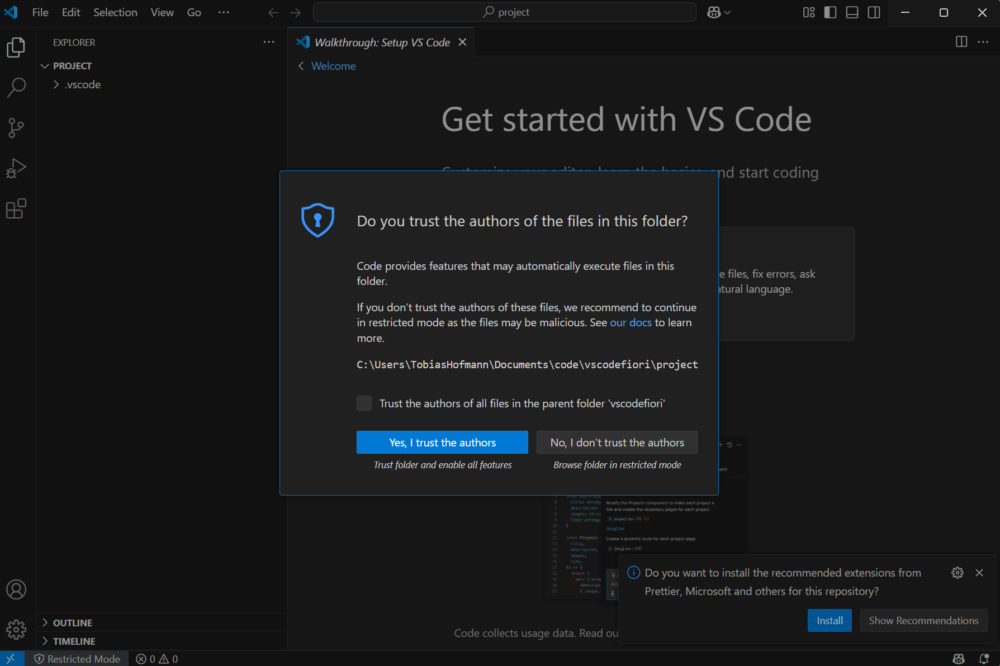
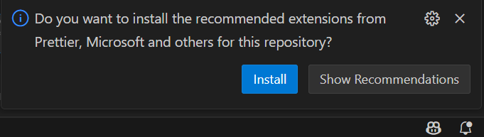
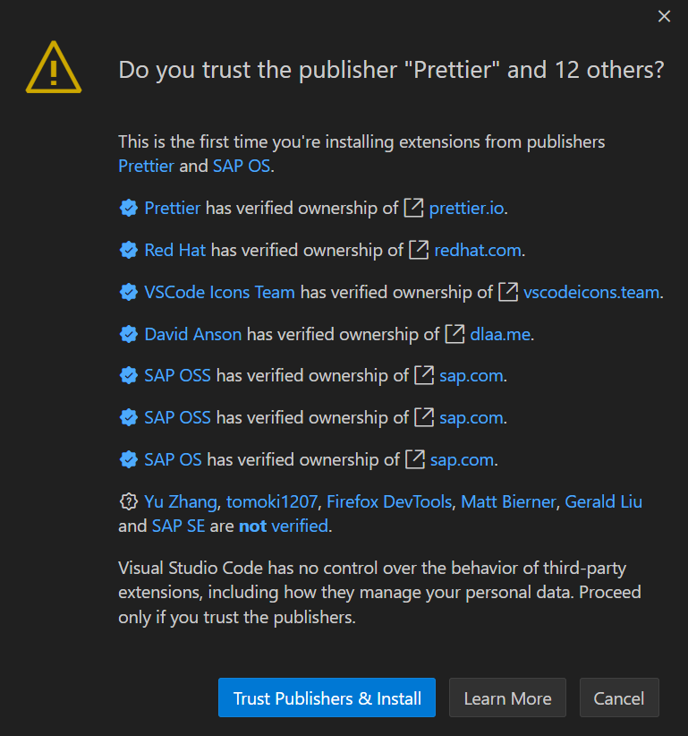
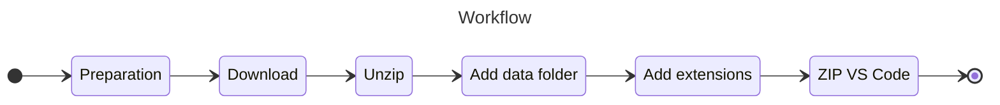
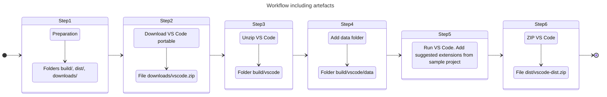

# VS Code for Fiori - Portable Edition all-in-on downloader and installer

This project creates a portable VS Code for SAP Fiori development. A set of recommended VS Code extensions is added to the resulting portable version. The intended platform for the build script is Windows.

## Build

To start the build, install the npm dependencies and run the start script.

```sh
npm i
npm start
```

**Use Cases**

- A portable VS Code for Fiori developers including a set of (recommended) extensions. The application can be stored on a external drive.
- Citrix environment:
  - Citrix admins can add the portable version to a workstation and provide it to developers. Be aware that portable VS Code is not multi user ready.
  - "Shared" version: The portable version is provided on a central share and Citrix users store the personalization folder data in their %AppData% oder home drive folder. This allows to run VS Code portable by several users simultanously.

**Base VS Code version**

The starting point of every portable VS Code app generated is the official download page.

- [VS Code download](https://code.visualstudio.com/Download)

## VS Code portable mode
 
General information about [VS Code portable mode](https://code.visualstudio.com/docs/editor/portable). Adding the folder _data_ makes VS Code portable.

### Adding extensions

VS Code allows to add extensions using the [cli](https://code.visualstudio.com/docs/configure/command-line) when starting VS Code:

- --install-extension *extension id*

To add the provided extension its installation must be manually approved. This can be done automatically by adding this parameter:

- --force

Unfortunately, this seems not to work with portable VS Code. Therefore, the extensions are added through workspace recommendations. The sample project for this approach is in [folder](./project/) and the extensions are listed in file [extensions.json](./project/.vscode/extensions.json).

## Extensions

List of the installed extensions:

|Extension | ID | Added with release
| :--- | :--- | ---: |
| Live Server | ritwickdey.liveserver | 2025.6 |
| Markdown all in one | yzhang.markdown-all-in-one | 2025.6 |
| Markdown Preview Mermaid Support | bierner.markdown-mermaid | 2025.6 |
| Markdownlint | davidanson.vscode-markdownlint | 2025.6 |
| Markmap | gera2ld.markmap-vscode | 2025.6 |
| vscode-pdf | tomoki1207.pdf | 2025.6 |
| yaml | redhat.vscode-yaml| 2025.6 |
| vscode-icons | vscode-icons-team.vscode-icons | 2025.6 |
| Debugger for Firefox | firefox-devtools.vscode-firefox-debug | 2025.6 |
| SAP Fiori Tools - Extension Pack | sapse.sap-ux-fiori-tools-extension-pack | 2025.6 |
| SAP Mobile Services OData CSDL modeler | sapse.vsc-extension-odata-csdl-modeler | 2025.6 |
| VS Code extension for project "Credential Digger" | saposs.vs-code-extension-for-project-credential-digger | 2025.6 |
| SAP CDS Language Support | sapse.vscode-cds | 2025.6 |
| Prettier| prettier.prettier-vscode replaces deprecated prettier esbenp.prettier-vscode | 2025.12    |
| SonarQube for IDE | sonarsource.sonarlint-vscode | 2025.12 |
| Connection Manager for SAP Systems | saposs.sap-ux-sap-systems-ext | 2025.12 |
| Coverage Gutters | ryanluker.vscode-coverage-gutters | 2025.12 |
| Playwright Test for VSCode | ms-playwright.playwright | 2025.12 |
| REST Client | humao.rest-client| 2025.12 |

## Build process

[Grunt](https://gruntjs.com). The individual steps are executed as GruntJS tasks. Several [Grunt Plugins](https://gruntjs.com/plugins) are used. To install GruntJS and the plugins, just run npm i. Running grunt can be done via npx.

```sh
npm i
npx grunt
```

This will start GruntJS and run the default tasks. That should be enough to get a working VS Code portable version. Each step of the workflow can be run individually by providing the task number. To run step 1, run grunt 1. To run the 3. step, run grunt 3.

```sh
grunt 1
grunt 2
grunt 3
```

All tasks run without user intercation, except step 5. At step 5, VS Code is started and the recommended extensions are installed. A human interaction is necessary to install the extensions.

Confirm that the folder content is trusted. In the project folder, the recommended extensions are read.



Confirm to install the recommended extensions.



Confirm that you trust the publishers of the extensions. Remember: the list of extensions to be installed can be adjusted by you. Add or remove extensions from the file project/.vscode/extensions.json



## Clean up

```sh
npx grunt clean
```

### Workflow



Several artefacts are going to be created during execution.



## Clean up

The goal of the build is to produce an artefact that is a portable VS Code in zip format: dist/vscode-dist.zip. All other files created during the build process can be deleted. This is done by running the grunt clean task

```sh
npx grunt clean
```